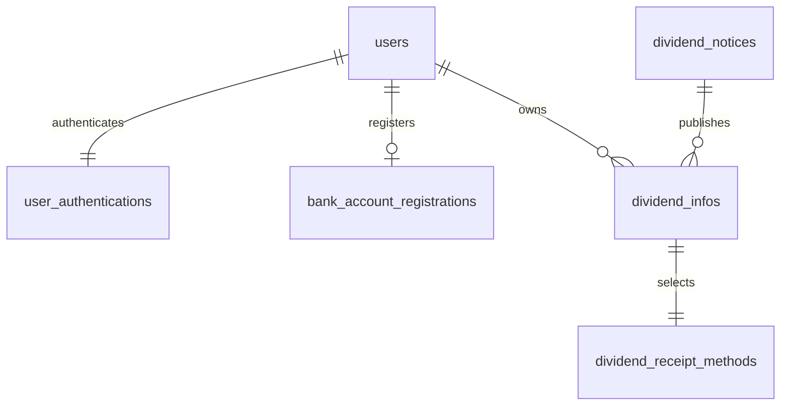
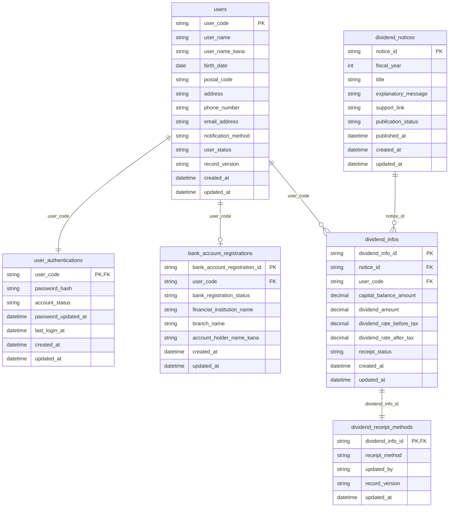

# ER図（ERD）

## 0. 命名・抽出方針

- 業務用語は画面・要件定義の表現に合わせて「組合員」を使用する。
- 論理名は用語集の統一名称に合わせて `user` を採用する。
- DBのテーブル名・項目名は命名規則に従い `snake_case` で記載する。
- セッション情報、ログ、監査ログ、既読管理は本書の対象外とする。
- 本ERDは要件定義書、機能一覧、各処理設計書の入力/出力項目、参照/更新対象、整合性ルールを根拠に作成する。

## 1. エンティティ一覧

| エンティティ名 | 論理テーブル名 | 種別 | 概要 | 主な属性 | 抽出根拠 |
|---|---|---|---|---|---|
| 組合員 | `users` | マスタ | 組合員本人の基本情報、連絡先、通知方法を保持する。 | `user_code`, `user_name`, `user_name_kana`, `birth_date`, `postal_code`, `address`, `phone_number`, `email_address`, `notification_method`, `user_status`, `record_version` | 要件定義書 7.データ要件の「組合員情報」、MYP_001 の入出力項目、MYP_001 の更新データ「組合員連絡先情報、通知方法」 |
| 認証情報 | `user_authentications` | マスタ | 組合員コードに対する認証情報を保持する。 | `user_code`, `password_hash`, `account_status`, `password_updated_at`, `last_login_at` | 要件定義書 7.データ要件の「認証情報」、LGN_001 の入力項目「組合員コード、パスワード」、LGN_001 の参照データ「認証情報」 |
| 出資配当金お知らせ | `dividend_notices` | マスタ | トップ画面に表示する年度別のお知らせ見出しと公開情報を保持する。 | `notice_id`, `fiscal_year`, `title`, `explanatory_message`, `support_link`, `publication_status`, `published_at` | 要件定義書 7.データ要件の「お知らせ情報」、TOP_001 の `notice_list`、DIV_001 の `notice_title`, `fiscal_year`, `explanatory_message`, `support_link` |
| 出資配当情報 | `dividend_infos` | トラン | 組合員ごとの年度別出資残高・配当金額・受取状況を保持する。 | `dividend_info_id`, `notice_id`, `user_code`, `capital_balance_amount`, `dividend_amount`, `dividend_rate_before_tax`, `dividend_rate_after_tax`, `receipt_status` | 要件定義書 7.データ要件の「出資情報」、DIV_001 の出力項目、DIV_001 の整合性ルール「notice_id と配当情報は同一年度かつ同一組合員に紐づく」 |
| 配当金受取方法情報 | `dividend_receipt_methods` | トラン | 組合員ごとの当年配当金受取方法を保持する。 | `dividend_info_id`, `receipt_method`, `updated_by`, `record_version`, `updated_at` | 要件定義書 7.データ要件の「配当金受取方法情報」、DIV_001 の出力項目 `receipt_method`、DIV_002 の更新データ「配当受取方法情報」 |
| 口座登録情報 | `bank_account_registrations` | マスタ | 登録口座振込の可否判定に必要な口座登録状態を保持する。 | `bank_account_registration_id`, `user_code`, `bank_registration_status`, `financial_institution_name`, `branch_name`, `account_holder_name_kana` | DIV_002 の参照データ「口座登録情報」、DIV_002 の業務エラー「登録口座振込を選択したが口座未登録」、MYP_001 の出力項目 `bank_registration_status` |

## 2. 概念ER図

### 2.1 概念モデルの整理

- 組合員は1つの認証情報を持つ。
- 組合員は0件または1件の口座登録情報を持つ。
- 出資配当金お知らせは複数組合員の出資配当情報に紐づく。
- 組合員は年度ごとに複数の出資配当情報を持つ。
- 出資配当情報ごとに1件の配当金受取方法情報を持つ。

### 2.2 Mermaid erDiagram

## 3. 論理ER図

### 3.1 論理モデル補足

- `users` は本人参照・本人更新の主体であり、マイページで更新対象となる連絡先情報と通知方法を保持する。
- `user_authentications` は認証専用テーブルであり、ログイン時は `users` の有効状態と合わせて参照する。
- `dividend_notices` はトップ画面の一覧表示単位である。
- `dividend_infos` は組合員別・お知らせ別の金融情報本体である。
- `dividend_receipt_methods` は `dividend_infos` に対する受取方法更新を担い、楽観ロック用 `record_version` を持つ。
- `bank_account_registrations` は「登録口座振込」の選択可否判定に利用する。

### 3.2 Mermaid erDiagram

## 4. 用語統一案

| 処理設計上の表現 | 本ERDでの統一表現 | 理由 |
|---|---|---|
| 組合員 / 利用者 | 業務名は「組合員」、論理名は `user` | 用語集で `user` を統一名称としているため |
| 配当金受取方法情報 / 配当受取方法情報 | `dividend_receipt_methods` | DIV_001 と DIV_002 の揺れを統一 |
| 口座登録情報 / 登録口座情報 | `bank_account_registrations` | MYP_001 と DIV_002 の表現を統一 |

## 5. 補足

- `session_id`、`csrf_token`、監査ログ、操作ログは抽出対象から除外した。
- トップ画面の `is_new` は既読管理の別機能で管理すると読み取れるため、本ERDには含めていない。
- マイページの `capital_balance_amount`、`receipt_method`、`bank_registration_status` は参照用項目であり、それぞれ `dividend_infos`、`dividend_receipt_methods`、`bank_account_registrations` から取得する前提とした。
