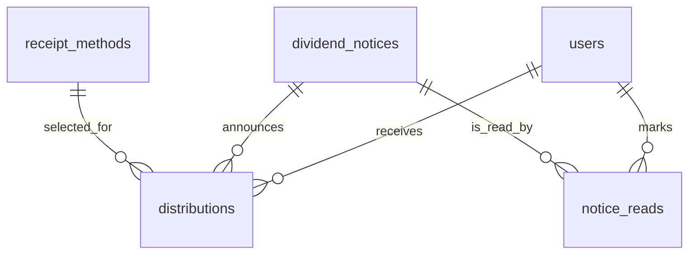
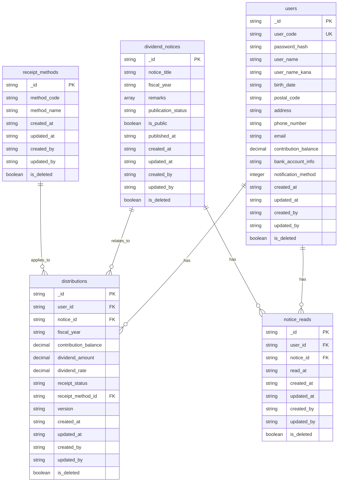

# ER図（ERD）

## 1. エンティティ一覧

| エンティティ名（種別） | 概要 | 根拠 |
|---|---|---|
| users（マスタ） | 組合員の基本情報と認証情報を保持する。 | [docs/ED/product/process-design/MYP_001_process-design.md](docs/ED/product/process-design/MYP_001_process-design.md) の 3.1, 3.3、[docs/ED/product/process-design/LGN_001_process-design.md](docs/ED/product/process-design/LGN_001_process-design.md) の 3.0 |
| dividend_notices（マスタ） | トップ画面に表示する出資配当金のお知らせを保持する。 | [docs/ED/product/process-design/TOP_001_process-design.md](docs/ED/product/process-design/TOP_001_process-design.md) の 3.0、[docs/ED/product/process-design/DIV_001_process-design.md](docs/ED/product/process-design/DIV_001_process-design.md) の 3.0 |
| distributions（トラン） | 組合員ごとの年度別出資配当情報と受取状況を保持する。 | [docs/ED/product/process-design/DIV_001_process-design.md](docs/ED/product/process-design/DIV_001_process-design.md) の 3.0、[docs/ED/product/process-design/DIV_002_process-design.md](docs/ED/product/process-design/DIV_002_process-design.md) の 3.0 |
| notice_reads（トラン） | 組合員ごとのお知らせ既読情報を保持する。 | [docs/ED/product/process-design/TOP_001_process-design.md](docs/ED/product/process-design/TOP_001_process-design.md) の 3.0 |
| receipt_methods（マスタ） | 配当金受取方法の候補値を保持する。 | [docs/ED/product/process-design/DIV_001_process-design.md](docs/ED/product/process-design/DIV_001_process-design.md) の 3.0、[docs/ED/product/process-design/DIV_002_process-design.md](docs/ED/product/process-design/DIV_002_process-design.md) の 3.0 |

補足:

- `auth_sessions` は [docs/requirements.md](docs/requirements.md) と [prompts/er_diargram.md](prompts/er_diargram.md) の指示に従い、セッション情報として ER 図の対象外とする。
- `receipt_method_master` という記述が処理設計に存在するが、[docs/rules/design/db-design-rule.md](docs/rules/design/db-design-rule.md) の複数形ルールに合わせ、本書では `receipt_methods` に統一する。
- `member` ではなく `user` を採用する名称統一は [docs/rules/common/glossary.md](docs/rules/common/glossary.md) に従う。

## 2. 概念ER図（Mermaid）

概念整理:

- `users` と `distributions` は 1:N とする。1 組合員に対して複数年度の配当情報が発生し得るため。
- `dividend_notices` と `distributions` は 1:N とする。画面遷移上は `noticeId` を起点に対象年度の配当情報へ到達しているため、本書では 1 件のお知らせに複数組合員の配当情報が紐づく前提で整理する。
- `users.notification_method` は単一選択の整数値とし、`0` は「通知しない」、`1` は「SMSで通知」を表す。

## 3. 論理ER図（Mermaid）

属性補足:

- `password_hash` は [docs/ED/product/process-design/LGN_001_process-design.md](docs/ED/product/process-design/LGN_001_process-design.md) の「パスワードをハッシュ化比較」から、`users` に保持される認証情報として採用した。
- `notification_method` は [docs/ED/product/process-design/MYP_001_process-design.md](docs/ED/product/process-design/MYP_001_process-design.md) の通知方法が 2 択であることを受け、NoSQL 前提で `users` に整数値保持する。
- `version` は [docs/ED/product/process-design/MYP_001_process-design.md](docs/ED/product/process-design/MYP_001_process-design.md) と [docs/ED/product/process-design/DIV_002_process-design.md](docs/ED/product/process-design/DIV_002_process-design.md) の楽観ロック記述を受けて採用した。
- `last_login_at` と `can_update_receipt_method` は画面返却用の算出値または運用値として扱い、本 ER 図の永続化項目からは除外した。

## 4. 前提・要確認事項

1. `dividend_notices` と `distributions` の関連は、画面遷移上 `noticeId` を起点に配当情報を取得しているため関連ありと整理した。ただし、実装時に年度だけで紐づける設計とする場合は `distributions.notice_id` は不要となる。
2. `contribution_balance` は [docs/requirements.md](docs/requirements.md) と [docs/ED/product/process-design/MYP_001_process-design.md](docs/ED/product/process-design/MYP_001_process-design.md) の両方で参照されるため `users` と `distributions` の双方に現れる。本書ではマイページ表示用の現時点残高を `users`、年度別通知時点の残高を `distributions` と整理した。
3. `receipt_status` は配当金受取方法とは別の管理項目として扱う。更新対象は `receipt_method_id`、状態遷移は業務イベントで更新される前提とする。
4. `bank_account_info` は現時点では自由記述だが、将来的に金融機関名・支店名・口座種別・口座番号へ分割する余地がある。
