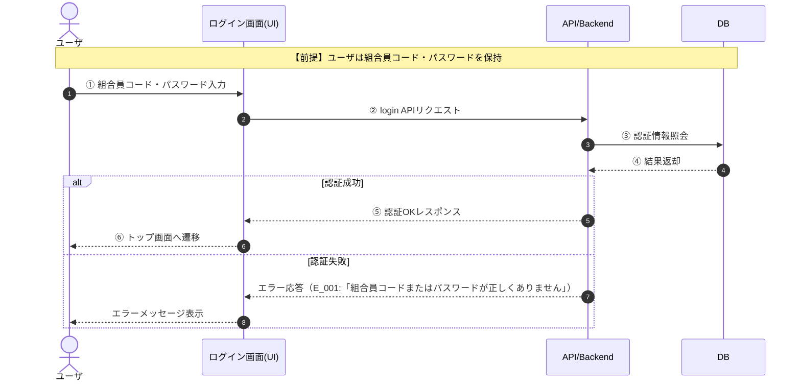
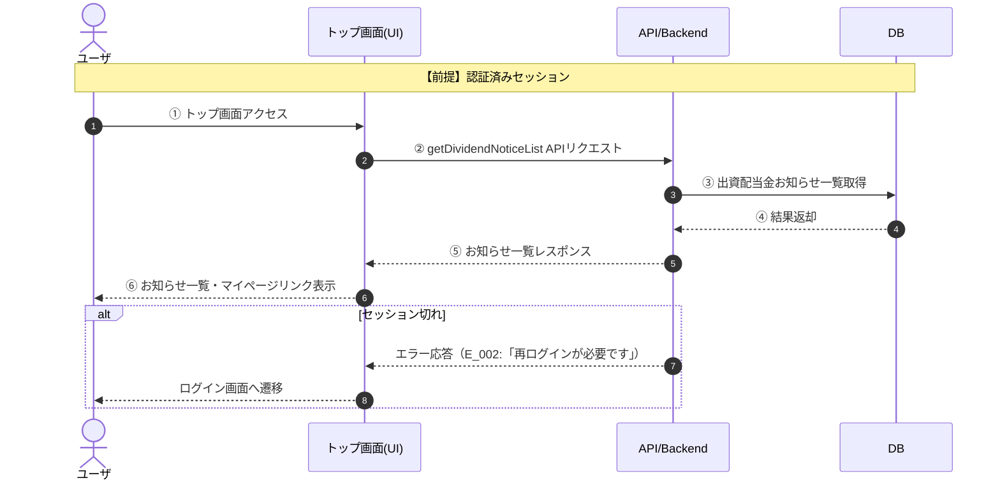
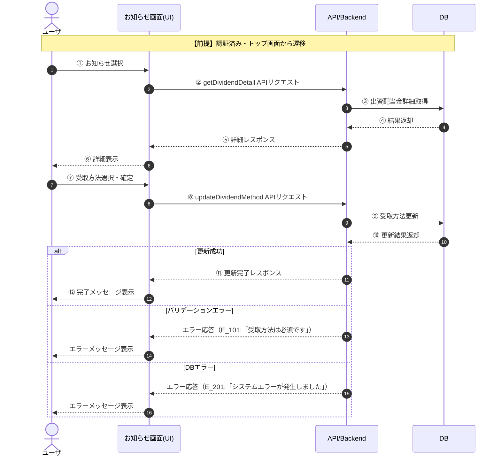
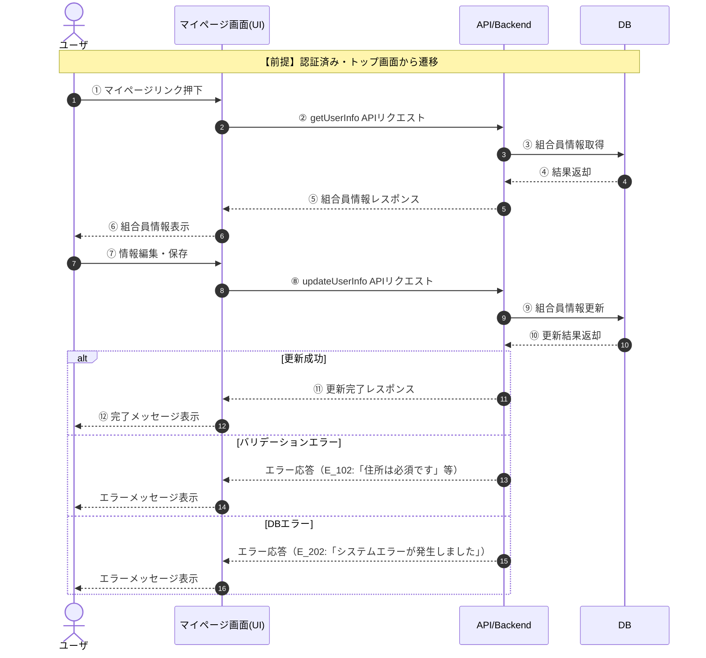

# シーケンス図一覧

- 図ID: SQ-001 / 対象機能: ログイン（LGN_001） / 概要: 組合員コード・パスワードによる認証
- 図ID: SQ-002 / 対象機能: トップ画面表示（TOP_001） / 概要: 出資配当金お知らせ一覧・マイページリンク表示
- 図ID: SQ-003 / 対象機能: 出資配当金お知らせ確認・受取方法変更（DIV_001, DIV_002） / 概要: 配当金情報参照・受取方法変更
- 図ID: SQ-004 / 対象機能: マイページ（MYP_001） / 概要: 組合員情報参照・更新

---

## SQ-001 ログイン（正常系・例外系）

---

## SQ-002 トップ画面表示

---

## SQ-003 出資配当金お知らせ確認・受取方法変更

---

## SQ-004 マイページ（組合員情報参照・更新）

---

※命名・用語・エラー形式は各ルールファイルに準拠しています。
