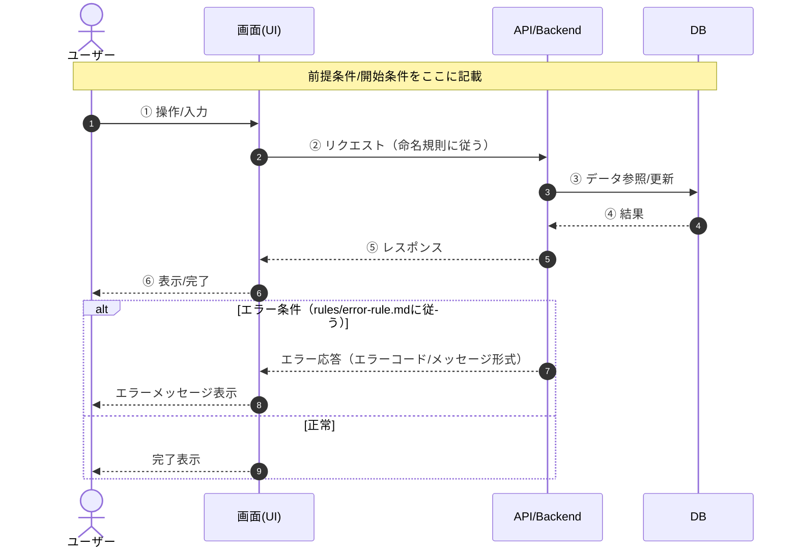

## シーケンス図
# シーケンス図一覧
- 図ID: SQ-xxx / 対象機能: xxxx / 概要: xxxx

# シーケンス図（Mermaid）

```mermaid
sequenceDiagram
    autonumber
    actor User as ユーザー
    participant UI as 画面(UI)
    participant API as API/Backend
    participant DB as DB
    %% 必要に応じて外部システムも participant として追加

    Note over User,DB: 前提条件/開始条件をここに記載

    User->>UI: ① 操作/入力
    UI->>API: ② リクエスト（命名規則に従う）
    API->>DB: ③ データ参照/更新
    DB-->>API: ④ 結果
    API-->>UI: ⑤ レスポンス
    UI-->>User: ⑥ 表示/完了

    alt エラー条件（rules/error-rule.mdに従う）
        API-->>UI: エラー応答（エラーコード/メッセージ形式）
        UI-->>User: エラーメッセージ表示
    else 正常
        UI-->>User: 完了表示
    end
```
