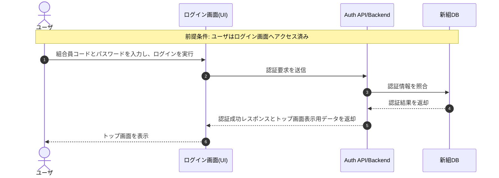
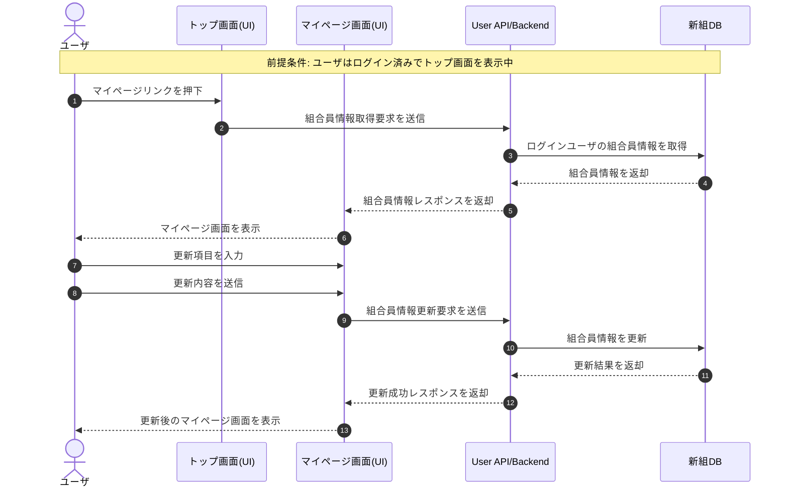
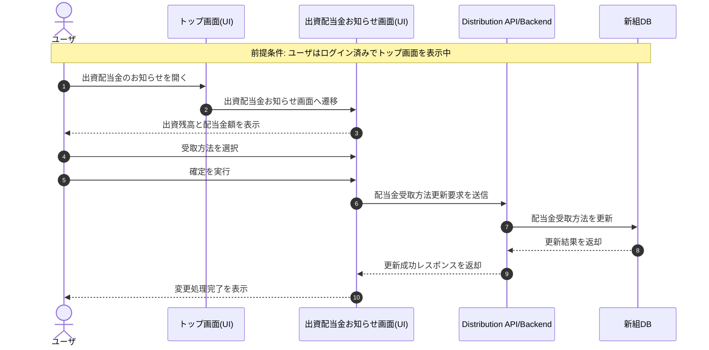
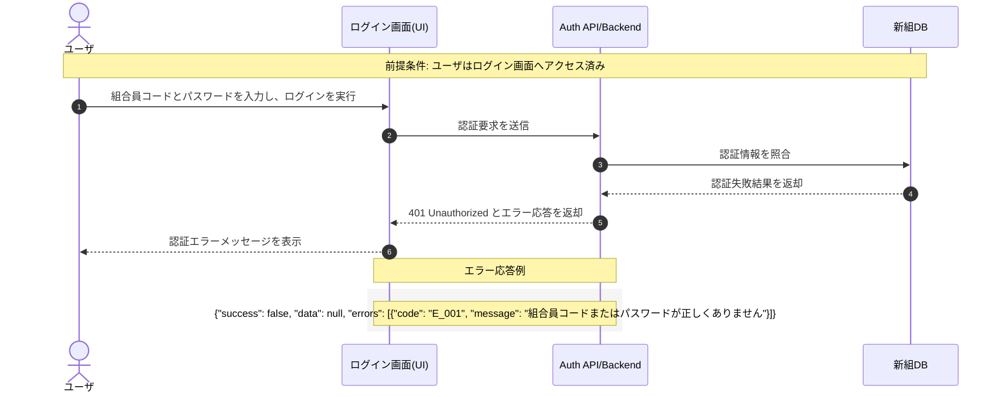

## シーケンス図

# シーケンス図一覧
- 図ID: SQ-001 / 対象機能: LGN_001 ログイン / 概要: ユーザが組合員コードとパスワードで認証し、トップ画面を表示する
- 図ID: SQ-002 / 対象機能: MYP_001 マイページ（組合員情報表示・更新） / 概要: ユーザがマイページを表示し、組合員情報を更新する
- 図ID: SQ-003 / 対象機能: DIV_002 配当金受取方法変更 / 概要: ユーザが出資配当金のお知らせ画面から受取方法を変更する
- 図ID: SQ-004 / 対象機能: LGN_001 ログイン（例外系） / 概要: 認証失敗時にエラーメッセージを表示する

# シーケンス図（Mermaid）

## SQ-001 ログイン

## SQ-002 マイページ表示・更新

## SQ-003 配当金受取方法変更

## SQ-004 ログイン認証失敗

